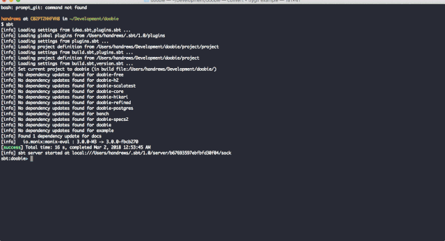

# sbt-thanks #

🌟 Say thanks to everyone who helps build and maintain your JVM dependencies on github

SCM information is obtained from the maven metadata.


 
## Requirements ## 

SBT 1.x

## Installation ## 

Currently sbt-thanks is only available from source and must be published locally 

```sbtshell
$ git clone git@github.com:hywelandrews/sbt-thanks.git
$ cd sbt-thanks
$ sbt publishLocal
```

Once published add the following line to either of these files:
- The project-specific file at `project/sbt-thanks.sbt`
- Your global file at `~/.sbt/1.0/plugins/sbt-thanks.sbt`

```sbtshell
addSbtPlugin("com.owlandrews" % "sbt-thanks" % "0.1.0")
```

Github API Credentials can be stored in a separate sbt file `thanks.sbt` in your global sbt 1.x settings folder

```scala
import com.owlandrews.sbt.thanks.ThanksPlugin
thanksPublicGitHubApiUser := "githubUsername"
thanksPublicGitHubApiKey  := "personal access token"
```

Github personal access tokens can be obtained [here](https://github.com/settings/tokens) 
Enable scope `public_repo` (Access public repositories)

## Contribution policy ##

Contributions via GitHub pull requests are gladly accepted from their original author. Along with
any pull requests, please state that the contribution is your original work and that you license
the work to the project under the project's open source license. Whether or not you state this
explicitly, by submitting any copyrighted material via pull request, email, or other means you
agree to license the material under the project's open source license and warrant that you have the
legal authority to do so.


## License ##

This code is open source software licensed under the
[MIT](https://opensource.org/licenses/MIT) license.
